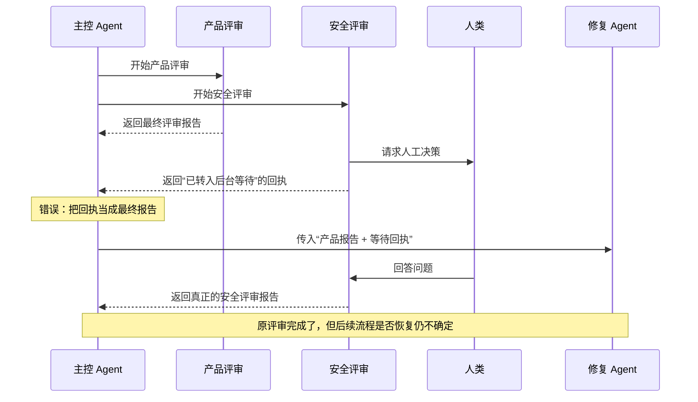
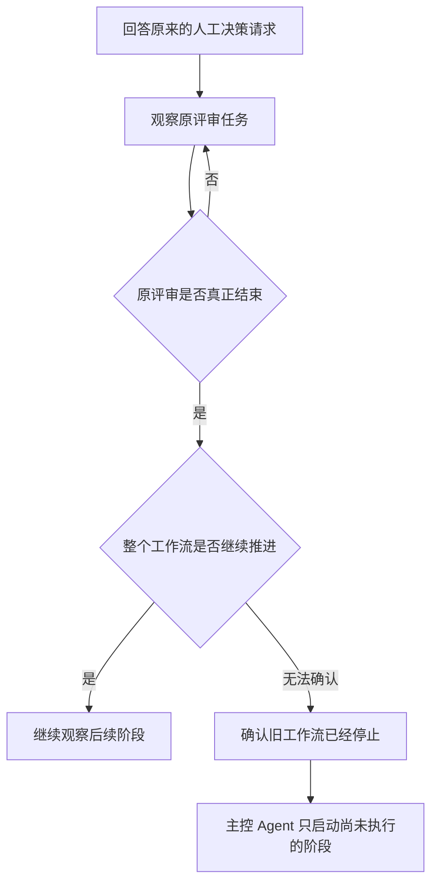

# 多 Agent 工作流为什么会提前结束：一次异步评审事故的完整复现

假设我们让一组 Agent 完成下面的工作：

1. 一个开发 Agent 修改代码并生成实施报告；
2. 两个评审 Agent 并行检查代码；
3. 其中一个评审过程中需要人类回答问题；
4. 两份评审结果交给开发 Agent 修复；
5. 最后再运行一次独立评审。

理想流程是：

```text
实现 → 并行评审 → 人工回答 → 修复 → 最终评审
```

实际发生的情况却是：

- 第一个评审正常完成；
- 第二个评审暂停并等待人工回答；
- 调度器收到一条“任务已转入后台等待”的回执；
- 外层工作流把这条回执误认为评审结果；
- 修复 Agent 收到的不是两份评审报告，而是一份报告加一条等待通知；
- 人工回答后，原评审任务继续完成，但外层工作流没有可靠地继续；
- 最终评审因此没有运行。

与此同时，开发 Agent 已经写好了代码和 Markdown 报告，但报告中的一小段机器验收数据不是合法 JSON，于是整个执行又显示为“验收失败”。

这不是单纯的 JSON 格式错误，也不是某个 Agent 忘了继续工作。真正的问题是：**系统把“收到通知”“任务结束”“验收通过”和“后续流程已恢复”混成了一件事。**

## 事故是怎样发生的？

下面的时序图还原了关键过程：



问题的关键不在于回执内容是否写着 “waiting” 或 “detached”，而在于外层调用已经结束。对于普通的 `Promise.all()` 来说，只要其中的 Promise 返回了一个值，它就算完成了。这个值究竟是最终报告还是“稍后再通知”，Promise 本身并不知道。

## 用一个最小程序复现

下面的示例不是 `pi-subagents` 源码，而是一个可以直接运行的最小模型。它保留了事故中最重要的两个特征：

- 等待人工回答的任务先返回一条回执；
- Markdown 中的机器验收块包含非法 JSON。

将代码保存为 `demo.mjs`：

```js
const delay = (ms) => new Promise((resolve) => setTimeout(resolve, ms));

function checkAcceptance(markdown) {
  const match = markdown.match(
    /```acceptance-report\n([\s\S]*?)```/,
  );

  if (!match) throw new Error("缺少机器验收数据");

  try {
    return JSON.parse(match[1]);
  } catch {
    throw new Error("机器验收数据不是合法 JSON");
  }
}

function startSecurityReview() {
  const finalResult = delay(100).then(() => ({
    type: "final-result",
    runId: "security-review-2",
    report: "安全评审完成：没有发现阻塞问题",
  }));

  return {
    immediateResult: {
      type: "receipt",
      runId: "security-review-2",
      status: "waiting-for-human",
      message: "评审任务正在等待人工回答",
    },
    finalResult,
  };
}

const implementationReport = `
# 实施报告

代码和测试已经完成。

\`\`\`acceptance-report
status: passed
\`\`\`
`;

try {
  checkAcceptance(implementationReport);
} catch (error) {
  console.log("验收失败：", error.message);
}

const productReview = Promise.resolve({
  type: "final-result",
  runId: "product-review-1",
  report: "产品评审完成：行为符合预期",
});

const securityReview = startSecurityReview();

const reviews = await Promise.all([
  productReview,
  Promise.resolve(securityReview.immediateResult),
]);

console.log(
  "修复 Agent 收到的内容：",
  reviews.map((item) => item.type),
);

console.log(
  "稍后才产生的安全评审：",
  (await securityReview.finalResult).report,
);
```

运行：

```bash
node demo.mjs
```

可以观察到：

```text
验收失败：机器验收数据不是合法 JSON
修复 Agent 收到的内容：[ 'final-result', 'receipt' ]
稍后才产生的安全评审：安全评审完成：没有发现阻塞问题
```

这个输出暴露了两个相互独立的问题。

第一，代码和 Markdown 报告依然存在，但机器验收没有通过。第二，`Promise.all()` 已经返回，修复 Agent 却没有拿到完整的评审结果。

## 为什么“已转入后台”不等于“已经完成”？

因为回执只回答了“系统是否接管了这个任务”，没有回答“任务是否已经产生最终结论”。

为了避免混淆，可以把状态分成两类：

| 状态 | 能否开始依赖它的下一步 |
| --- | --- |
| 正在运行 | 不能 |
| 等待人工回答 | 不能 |
| 已暂停 | 不能 |
| 已转入后台 | 不能 |
| 状态未知 | 不能 |
| 成功结束 | 可以根据结果继续 |
| 失败或验收被拒绝 | 可以进入失败处理 |
| 已取消或停止 | 可以进入取消处理 |

失败和取消也是结束状态，但它们不会自动进入成功路径。它们只是说明原任务不会再继续运行，主控 Agent 可以据此决定停止、重试、降级或交给人处理。

真正安全的判断不应该检查返回文本里有没有“完成”两个字，而应该同时确认：

1. 状态来自预期的那一个任务；
2. 宿主明确报告该任务已经结束；
3. 预期报告或文件已经最终写入；
4. 所有并行评审都已结束。

## 人工回答之后，为什么工作流仍可能不继续？

因为“评审任务继续运行”和“整个工作流继续运行”不是同一件事。

人类回答问题后，系统通常能恢复原来的评审任务。评审 Agent 会继续分析，并最终生成安全评审报告。

但外层工作流可能早已结束、暂停，或者只保存了当前任务，没有保存后面的“修复”和“最终评审”。因此，看到安全评审完成并不能证明后续阶段也会自动执行。

安全的恢复顺序应该是：



这里有一个很重要的限制：如果无法确认旧工作流是否还会继续，就不能立刻启动一个替代修复 Agent。否则，旧工作流稍后恢复时，两个 Agent 可能同时修改同一批文件。

## Markdown 验收失败后，为什么不应该重新实现？

事故中的 Markdown 文件同时承担了两种职责：

- 正文是给人看的实施报告；
- `acceptance-report` 代码块是给程序读取的验收数据。

合法格式应该类似：

```json
{
  "status": "satisfied",
  "evidence": [
    "tests passed",
    "workspace diff verified"
  ]
}
```

如果 Agent 写成：

```yaml
status: passed
```

机器验收应当拒绝它，因为这不是约定的 JSON。但拒绝验收时仍应保留代码、测试、Markdown 报告、任务编号和解析错误。

最小修复是让原 Agent 只改正验收数据，然后确认代码区没有发生额外变化。无法恢复原 Agent 时，也可以由主控 Agent 根据当前仓库重新核验证据。

**验收报告损坏，不代表实现成果应该被删除或重做。**

## 新版运行时修复了什么？

在这次验证中，`pi-subagents 0.52.1` 仍存在一个危险行为：等待人工回答的子任务完成后，外层工作流可能被直接标记为完成，即使后续步骤没有得到可靠恢复。

从 `0.58.0` 开始，上游修改了这一行为。无法证明后续流程已经恢复时，运行时会明确保留一份“需要继续处理”的交接信息，而不是把整个工作流显示为完成。

当前验证的 `0.66.0` 已包含这项修复，并通过了相关的定向测试。测试同时确认：

- 非法验收数据仍会导致验收拒绝；
- 已生成的 Markdown 和其他产物会被保留；
- 重复完成通知不会让同一个工作流继续两次。

本次没有完成真实模型服务下的端到端测试，因此这些结论来自源码检查和本地自动化回归，不应扩大成对所有宿主和模型组合的保证。

## 运行时升级后，为什么还需要保守编排？

因为不是每个 Agent 宿主都明确保证：

- 等待通知不会被当成最终结果；
- 并行等待只会在所有任务真正结束后返回；
- 人工回答后，整个工作流一定从原位置继续。

如果宿主无法明确给出这些保证，最稳妥的方式是把流程拆成几段：

```text
实现
↓
确认实现任务结束
↓
并行评审
↓
确认所有评审结束
↓
修复
↓
确认修复任务结束
↓
最终评审
↓
主控 Agent 验收
```

这样做并不是放弃并行执行。两个互不依赖的评审仍然可以同时运行，只是依赖它们的修复阶段必须由主控 Agent 在结果收齐后显式启动。

## 下次如何检查同类问题？

遇到异步 Agent 工作流时，先问五个具体问题：

1. 当前拿到的是等待回执，还是最终结果？
2. 这份结果是否属于预期的任务编号？
3. 所有并行任务是否都已经结束？
4. 人工回答后，是只有原任务恢复，还是整个后续流程都恢复了？
5. 如果状态无法确认，谁负责等待和启动剩余步骤？

只要其中一个答案是“不知道”，就不要自动开始下一阶段。

可以把整次事故浓缩成三条规则：

> 等待回执不能冒充最终结果。  
> 原任务恢复不能证明整个工作流已经恢复。  
> 验收数据损坏不能抹掉已经存在的实现成果。

掌握这三个区别后，即使更换 Agent 框架或宿主，也能判断一条异步工作流是在可靠地继续，还是仅仅“看起来已经完成”。
