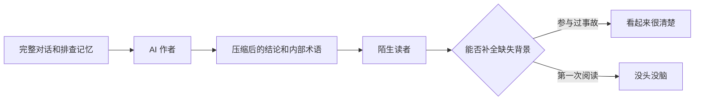
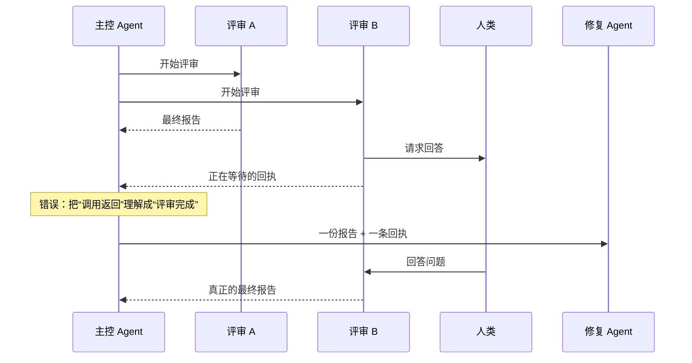
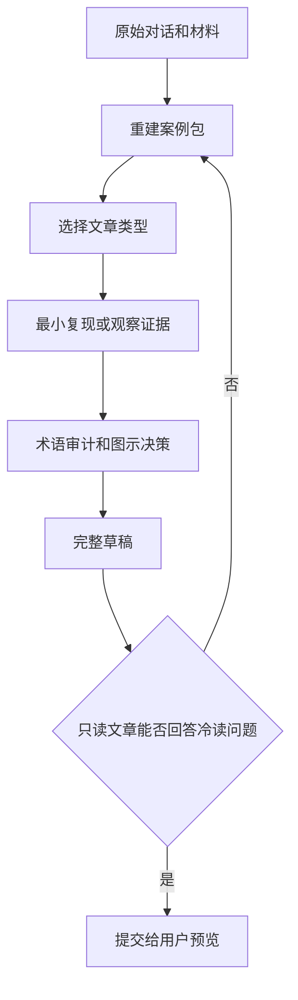

# AI 为什么会写出“只有自己看得懂”的技术博客：从一次失败输出重设计写作 Skill

一次复杂的多 Agent 异步故障修复完成后，我让 AI 把问题整理成技术博客。材料很充分：原始错误、触发流程、版本差异、修复方案和测试结果都在对话里。

AI 也确实写出了一篇结构完整的文章。它有标题、问题分析、解决方案和检查清单，却很难读懂。

文章一开头就讨论 `receipt`、`barrier`、`continuation`、`detached` 和 `terminal result`，既没有先说明系统原本要做什么，也没有让读者看到故障如何发生。参与过排查的人能靠记忆补全上下文，第一次接触这个问题的读者只能面对一串陌生术语。

这次失败说明：**写作 Skill 不能只要求 AI“面向读者、提供例子、避免术语”。它还必须定义陌生读者需要哪些上下文，并设置一个不依赖原始对话的完成检查。**

## 原始输出为什么让人没头没脑？

第一版文章以这样的表达开场：

> 一个 reviewer 请求主管决策后进入 detached 状态，外层 workflow 却继续执行，把等待通知当成正式评审结果传给 writer。与此同时，malformed acceptance 又导致验收失败。

这段话对排查者很紧凑，但陌生读者会立即遇到一连串问题：

- reviewer 在评审什么？
- 为什么需要主管决策？
- detached 是暂停、失败还是结束？
- writer 收到什么会造成什么后果？
- acceptance 验收的是代码、报告还是整个工作流？
- 正常流程本来应该怎样运行？

这些信息不是文章后面补一个术语表就能解决的。问题出在文章起点：作者直接站在结论处说话，却没有先把读者带到事故现场。

修改后的开场先还原完整流程：

> 一个开发 Agent 修改代码，两个评审 Agent 并行检查，修复 Agent 根据两份报告修改，最后再运行一次独立评审。其中一个评审向人类提问后，只返回了一条“正在等待”的通知，外层流程却把它当成正式报告交给了修复 Agent。

即使读者不知道任何项目内部名词，也能先理解参与者、正常目标、实际偏差和直接后果。术语可以稍后出现，因为读者已经知道它们需要解释什么现象。



AI 写作者拥有全部上下文，读者却没有。这个差异就是文章失败的起点。

## 为什么写作原则齐全，文章仍然失败？

当时的写作 Skill 已经包含许多正确要求：

- 明确目标读者；
- 先写读者收益；
- 选择教程、排障、解释或参考类型；
- 尽量提供最小复现；
- 少写工作过程；
- 在合适时使用图表；
- 起草后进行一次自我批评。

问题不是缺少原则，而是这些原则大多属于软性建议。AI 可以认为：

- 这篇文章更偏概念解释，所以不需要复现；
- `continuation` 是技术词，不需要翻译；
- 时序关系已经用文字说过，不必再画图；
- 开头已经提出问题，因此符合“面向读者”。

每一项单独看都说得通，组合起来却产生了一篇只有作者自己理解的文章。

这类 Skill 的真正缺陷是**完成条件不清楚**。它告诉 AI 应该注意什么，却没有告诉 AI 在什么情况下必须停止预览并重写。

## 第一步：先为事故文章重建“案例包”

对话不能直接变成文章。它首先应该变成一份不依赖谈话顺序的案例包：

```text
系统和参与者：
读者可理解的目标：
正常流程：
触发条件：
实际症状：
直接后果：
最小复现或观察记录：
实际输出：
根因：
修复方式：
涉及版本：
尚未验证的范围：
```

这个案例包不是文章目录，而是写作前的证据检查。只要“正常流程、实际症状、直接后果”有一项无法回答，AI 就还没有足够信息为陌生读者讲述事故。

它还解决了另一个常见问题：对话往往按排查时间展开，文章却应该按理解顺序展开。排查可能经历猜测、失败尝试和方案反复，读者首先需要的却是正常行为与实际行为之间的差异。

> 对话保存的是发现顺序；案例包重建的是理解顺序。

## 第二步：让读者亲眼看到问题

排障文章不能只告诉读者“这里有一个异步状态问题”。如果证据允许，它必须提供一个能够观察因果关系的最小示例。

原始系统可能包含多个 Agent、后台任务、人工提问和验收协议，不适合复制到公开文章。最小复现不需要还原全部源码，只需要保留造成问题的因果关系：

```js
const reviews = await Promise.all([
  Promise.resolve({ type: "final-report" }),
  Promise.resolve({ type: "waiting-receipt" }),
]);

console.log(reviews.map((item) => item.type));
```

输出：

```text
[ 'final-report', 'waiting-receipt' ]
```

这个例子让读者直接看到：`Promise.all()` 只知道两个 Promise 都返回了值，不知道第二个值在业务上只是一条等待通知。

然后文章才能自然解释修复条件：

```js
const allFinal = reviews.every(
  (item) => item.type === "final-report",
);

if (!allFinal) {
  throw new Error("评审结果尚未收齐");
}
```

示例的价值不在于它复制了真实调度器，而在于它隔离了一个可观察事实：**函数返回一个对象，不代表业务任务已经完成。**

如果事故无法安全复现，文章也至少要提供去敏后的日志、时序或状态表，并明确说明为什么这是当前最强的证据。既没有复现，也没有观察记录时，Skill 应阻止排障文章进入预览，而不是用更多抽象解释填满空白。

## 第三步：对术语做读者级别的审计

“少用术语”很难执行，因为所有技术文章都需要术语。更有效的方法是把词分成三类：

| 术语类型 | 例子 | 处理方式 |
| --- | --- | --- |
| 广泛使用的标准术语 | JSON、Markdown、Promise | 可以保留 |
| 公开 API 或源码标识 | `Promise.all()`、`acceptance-report` | 保留精确写法，首次出现时解释作用 |
| 项目内部或不常见表达 | receipt、barrier、continuation | 翻译、删除，或先用自然语言解释 |

例如：

- receipt → 等待回执；
- dependency barrier → 下一阶段的等待条件；
- continuation → 后续流程恢复；
- detached → 已脱离当前调用并在后台等待。

英文词并不是天然不友好。问题在于作者把一个读者没有学过的词，当成理解下一段的前提。

术语审计应该重点检查标题、开头和小标题。如果一个只懂普通 JavaScript 和 Coding Agent 的读者必须查看项目源码才能理解标题，这篇文章就还不能发布。

## 第四步：图要解释关系，而不是装饰页面

异步问题通常包含参与者顺序、状态变化和阶段依赖。纯文字需要读者在脑中同时保存这些关系，图示则可以把错误转换直接暴露出来。



这张图的作用不是让文章更好看，而是明确标出错误发生在哪一次转换。

因此，写作 Skill 可以按信息结构选择表达方式：

- 三个以上参与者交换消息：优先时序图；
- 暂停、恢复、失败和完成：优先流程图或状态图；
- 多个阶段互相依赖：优先流程图；
- 版本行为差异：使用对比表；
- 单一命令及结果：使用代码块和输出块。

不是每篇文章都必须画图，但当文章解释的正是时序和状态关系时，“不用图”应该有理由，而不是默认选择。

## 最关键的一步：让文章接受一次“冷读”

普通自我审稿无法发现这类问题，因为审稿的 AI 仍然拥有完整对话。它知道所有参与者和术语，所以很容易觉得文章已经足够清楚。

更可靠的检查方式是只阅读文章本身，然后回答：

1. 这是什么系统，谁参与其中？
2. 它原本想完成什么？
3. 实际发生了什么，造成什么后果？
4. 读者如何复现或直接观察问题？
5. 哪个证据证明了根因，而不只是表面错误？
6. 修复了什么，如何验证？
7. 哪些环境和结论仍未验证？

如果任何关键答案需要回到原始对话才能得到，文章就没有通过冷读。

这个检查应该是阻塞条件，而不是一条“请注意上下文完整”的建议。



## 写作质量之外，操作权限也要明确

这次还暴露了另一个 Skill 设计问题：用户只想先准备文章、以后自行提交，但原流程把“写文件、提交和推送”绑定成了一次发布授权。

更安全的做法是先确定操作模式：

| 模式 | 写文章 | 更新索引 | 提交 | 推送 |
| --- | ---: | ---: | ---: | ---: |
| 只搜索 | 否 | 否 | 否 | 否 |
| 只预览 | 否 | 否 | 否 | 否 |
| 本地准备 | 是 | 是 | 否 | 否 |
| 正式发布 | 是 | 是 | 是 | 是 |

权限边界也是输出质量的一部分。一个文章写得很好，却执行了用户没有要求的提交或推送，仍然是不合格的 Agent 行为。

## 如何验证写作 Skill 真的改善了？

检查 Skill 文件里是否出现“陌生读者、最小复现、术语审计”等句子，只能证明规则存在，不能证明模型会执行。

至少需要三层验证：

1. **静态检查**：关键分支、权限模式和完成条件没有被删除；
2. **变异检查**：故意把“必须复现”改成“可以复现”，检查器应当失败；
3. **全新上下文重放**：不给写作 Agent 提供后续批评，只给原始事故材料，看首轮文章是否已经自包含。

这次修改增加了事故文章分支、七项规则变异检查和五个行为场景。不过，行为场景目前主要用于定义验收标准，还不能代替完整的模型评测。

一次新的无会话预览诊断已经能够生成：

- 完整事故背景；
- 可执行的最小示例；
- 实际与预期输出；
- 中文术语解释；
- 时序图；
- 版本和验证边界。

但目标博客中已经存在相关成稿，因此这次结果可能受到已有文章影响，不能当作完全隔离的最终证明。真正的验收仍应在没有同主题文章的临时仓库中重放。

## 把写作建议变成完成条件

下次设计 AI 写作 Skill 时，不要只问“我们是否提醒它面向读者”。

还要检查：

- 是否重建了陌生读者需要的最小背景？
- 是否让故障或结论可以被直接观察？
- 是否区分标准术语、公开标识和内部说法？
- 是否为时序、状态和依赖选择了合适的图？
- 是否在脱离原始对话后重新检查文章？
- 是否把写文件、提交和发布拆成不同权限？

写作原则只有转化成步骤、证据和阻塞条件，才能稳定改变 AI 的输出。

否则，AI 很可能写出一篇结构正确、事实正确，却只有它自己和对话参与者看得懂的文章。
