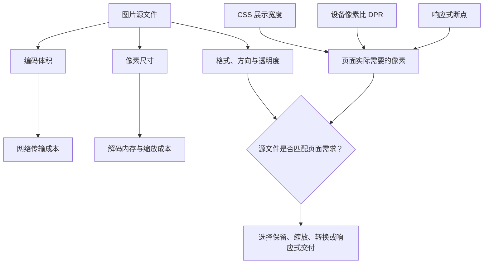
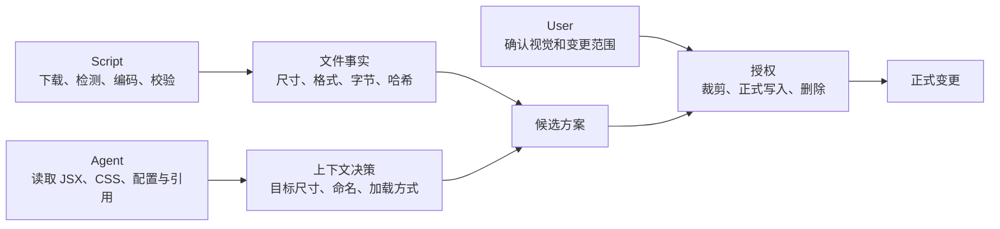
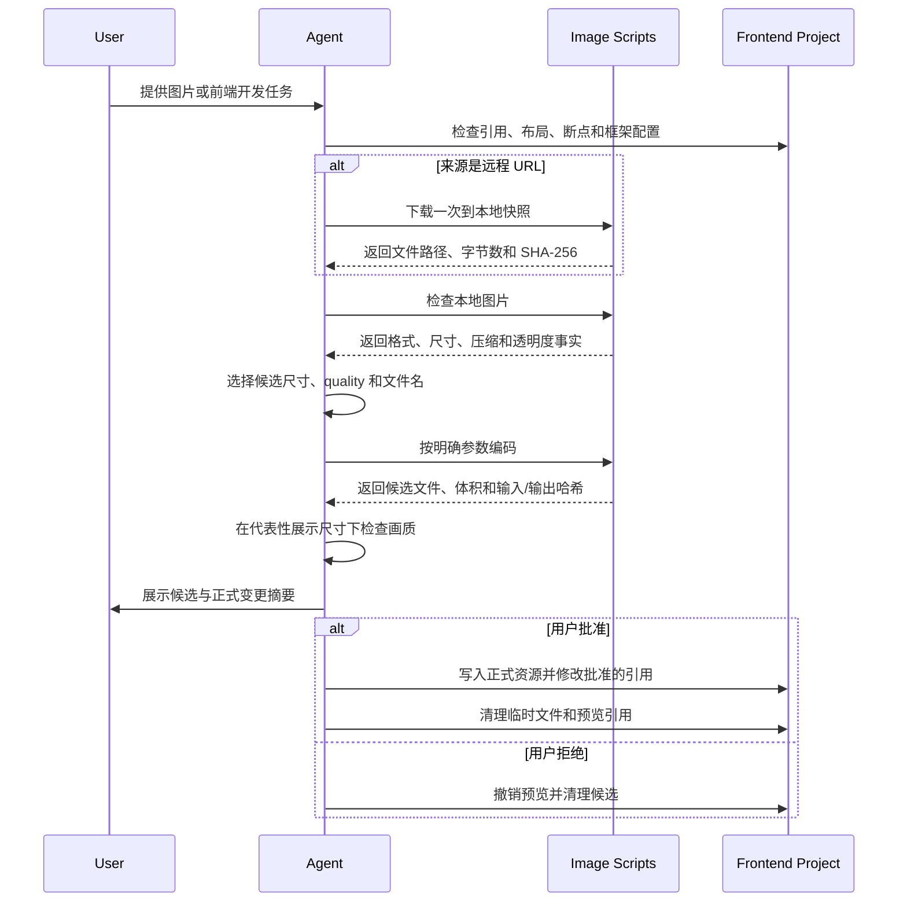

# 为什么图片优化不能只是压缩：设计一个可信的 Web 图片优化 Skill

把 PNG 转成 WebP 并不难。真正困难的是：图片应该缩到多大、能不能裁剪、是否需要多个响应式版本，以及什么时候可以正式替换项目资源。

这些问题无法只靠读取图片文件回答。它们同时依赖文件属性、页面布局和用户意图。

`web-optimize-images` 因此不是一个简单的图片压缩脚本。它是一套由确定性脚本、上下文 Agent 和用户授权共同组成的工作流：

- 脚本证明图片是什么，以及明确参数产生了什么结果；
- Agent 理解图片在 React 或 Next.js 页面中如何使用；
- 用户决定是否接受裁剪、正式写入、代码修改和资源删除。

这套设计解决的核心问题是：如何在自动化图片优化的同时，让每个结论都有依据，每个正式变更都有清晰边界。

## 这个 Skill 能做什么？

它覆盖从图片来源到前端应用的完整优化过程，但不会把所有步骤都塞进脚本。

| 阶段 | 能力 | 输出 |
| --- | --- | --- |
| 获取来源 | 接收本地文件、远程图片或已经导出的设计资源 | 一份稳定的本地源文件 |
| 检查 | 识别真实格式、尺寸、方向、压缩类型、页数和有效透明度 | 客观图片事实 |
| 编码 | 按明确尺寸和 quality 生成有损 WebP | 可复现的候选文件 |
| 验证 | 检查尺寸边界、透明度、动画、文件体积和哈希 | 可验证的候选结果 |
| 页面分析 | 阅读 React、Next.js、CSS 和图片配置 | 尺寸、加载和响应式建议 |
| 预览与应用 | 在代表性尺寸下比较结果，展示正式变更摘要 | 经用户批准的资源与代码变更 |

编码器会自动处理方向、转换到 sRGB、保留真实透明度，并拒绝放大、覆盖已有文件或把动画静态化。

但它不会根据图片内容自动决定目标尺寸、quality、文件名、`alt`、响应式断点和最终目录。这些结论都需要页面上下文。

## 为什么需要专门设计这个 Skill？

因为“图片已经压缩”和“图片已经适合页面”是两件不同的事。

一张图片可能已经采用有损 WebP，文件体积也不算大，但像素尺寸仍明显超过页面需求。浏览器仍要传输、解码和缩放这些多余像素，Lighthouse 也可能提示图片交付尺寸不合理。

反过来，一次缩放后的候选文件也可能比原图更大。这只能说明当前编码质量或参数不合适，不能证明原图尺寸合理。



图中的两条路径必须分开判断：

- 编码体积影响网络传输；
- 像素尺寸影响解码、内存和页面所需资源。

所以图片优化不能只比较文件大小，也不能只比较宽高。候选是否合适，需要同时观察尺寸、字节数和实际渲染质量。

## 其中涉及哪些前端图片原理？

### 页面需要的不是原图尺寸，而是展示尺寸乘以合理 DPR

一个常用估算是：

```text
所需像素宽度 ≈ 最大 CSS 展示宽度 × 合理的设备像素比
```

例如，一张图片最大显示为 `600px`，若需要覆盖 DPR 2 的设备，约 `1200px` 宽的源图通常已经足够。直接交付 `4000px` 宽的图片，一般不会让它在这个位置更清晰，只会增加额外成本。

这只是决策起点，不是固定规则。还要继续检查：

- 图片是否会在弹窗、轮播或放大视图中使用；
- 用户是否可以下载原图；
- 不同断点是否使用相同构图；
- 页面是否已有 CDN 或框架级图片转换；
- 图片中的小字号文字是否对压缩特别敏感。

### `width` 和 `height` 不等于 CSS 展示尺寸

HTML 属性可以为浏览器提供固有宽高比，帮助减少布局偏移，但图片最终显示多大，仍由 CSS 和父容器决定。

Agent 需要读取：

- `width`、`max-width`、`height` 和 `aspect-ratio`；
- Grid、Flex、容器宽度、gap 和 padding；
- 媒体查询与容器查询；
- `object-fit` 和 `object-position`；
- 图片的所有共享引用。

如果只看 JSX 中的数字，可能会低估或高估图片真正需要的像素。

### 响应式图片解决的是资源选择，不一定是构图变化

普通的响应式图片允许浏览器根据视口、DPR 和 `sizes` 选择合适宽度：

```html

```

这里的多个文件应当是同一构图的分辨率版本。移动端如果需要改变主体位置或裁掉不同区域，那属于 art direction，需要单独批准。

`srcset` 也不是文件越多越好。固定尺寸的头像、图标和后台截图通常只需要一个合理版本；Hero、Banner 和可能成为 LCP 的大图，才更可能从多尺寸交付中获益。

### LCP、懒加载和布局稳定性属于图片优化的一部分

图片文件变小不代表加载策略正确。

- 可能成为 LCP 的首屏图片不应盲目懒加载；
- 非首屏内容可以结合项目习惯使用懒加载；
- 明确固有宽高比可以减少布局偏移；
- `alt` 取决于图片语义，不能从像素内容自动推断；
- CSS 背景图没有 `alt`，只适合装饰内容或已有替代文本的场景。

图片优化因此同时是资源处理问题和页面集成问题。

## React 与 Next.js 为什么需要不同策略？

普通 React 项目没有统一的图片优化器。Agent 需要先识别项目采用静态 import、公开目录、CDN URL，还是自定义图片组件，再决定是否生成一个或多个本地文件。

当响应式收益明确时，可以使用 `<picture>`、`srcSet` 和 `sizes`。但 Agent 必须保证每个宽度描述符对应真实存在、经过验证的文件，不能让多个描述符全部指向同一张图片。

Next.js 还多了一层框架行为。Agent 需要检查：

- 实际安装的 Next.js 版本；
- Pages Router 或 App Router；
- `images.unoptimized`；
- `deviceSizes` 和 `imageSizes`；
- 远程图片规则；
- 自定义 loader 和静态导出。

如果图片优化器正常工作，通常只需要提供一张合适的高质量母图，并正确设置 `sizes`，让 Next.js 生成交付宽度。

如果优化器被禁用、绕过或无法在部署方式中执行，才需要考虑手动制作多尺寸图片。

> 响应式交付能力已经由框架提供时，Skill 应补足母图和页面语义，而不是重复生成框架已经能够产生的所有尺寸。

## 为什么脚本不能负责所有决策？

因为图片优化中的信息分为三类，而三类信息具有不同的可信来源。



脚本适合处理可重复、可验证的事情。例如：

- 下载了哪一份远程字节；
- 图片真实格式和尺寸是什么；
- 指定参数产生了什么输出；
- 输出是否超出尺寸限制；
- 输入和输出的 SHA-256 是什么。

Agent 适合处理依赖项目语义的事情。例如：

- 图片在页面上最大显示多大；
- 是否还有弹窗、下载或共享用途；
- 应该使用 import、公开 URL 还是 `next/image`；
- 图片是否值得提供多个宽度；
- 文件名和 `alt` 应如何表达用途。

用户则负责不可由程序推断的授权：

- 是否接受裁剪或构图变化；
- 是否正式写入资源目录；
- 是否修改源码引用；
- 是否删除旧文件。

这种边界比“让一个脚本维护完整状态机”更可信。程序可以记录事实，但一个 `approved: true` 字段不能证明用户批准的是哪一张候选图、哪一次裁剪和哪些删除操作。

## 为什么远程图片必须先保存成本地快照？

因为 URL 是一个位置，不是一份不可变化的内容。

如果检查命令和编码命令各自下载一次，它们可能获得不同字节。即使 URL 相同，也无法证明最终编码的是刚才检查过的图片。

更可靠的流程是：

1. 下载一次；
2. 保存为项目内的临时源文件；
3. 检查这份本地文件；
4. 所有编码尝试都读取同一份文件；
5. 比较检查与编码结果中的源文件 SHA-256。

本地快照同时解决了两个问题：

- 避免重复下载；
- 建立从检查到候选输出的输入一致性。

哈希不是为了替代视觉检查，而是为了证明所有后续结论都建立在同一份源文件上。

## 完整工作流是如何设计的？

整个流程将可逆的候选操作和正式变更分开。



候选文件默认放在项目忽略的工作目录中。只有必须通过开发服务器验证页面行为时，才临时复制到应用可访问的静态目录。

Git ignore 只能阻止文件进入版本控制，不能阻止公开静态目录中的文件进入构建产物。因此在完成或取消后，必须同时清理临时引用和文件。

## 两个案例如何影响验证设计？

### 有 Alpha 通道，不代表图片真的使用了透明度

某些 PNG 包含 Alpha 通道，但所有像素仍完全不透明。如果验证器只检查 `hasAlpha`，就可能把视觉上正确的输出判定为失败。

需要区分：

- `hasAlpha`：文件结构中是否存在 Alpha 通道；
- `hasTransparency`：像素是否真的使用了透明度。

真正需要保护的是可见透明度，而不是冗余的通道结构。

### 候选文件变大，不代表图片不需要缩放

如果一张已经高度压缩的 WebP 使用较高 quality 重新编码，即使像素尺寸变小，文件也可能变大。

正确结论是“这次参数不合适”，而不是“原图无需优化”。下一步可以降低候选 quality、检查视觉差异，或者保留原图。

这两个案例体现同一条验证原则：

> 元数据和单次编码结果只是证据，不能替代真正需要保护的页面性质。

## 哪些边界必须保留？

这个 Skill 不应该：

- 根据图片内容自动选择未经验证的压缩模式；
- 在没有页面上下文时猜测目标尺寸；
- 把响应式图片变成所有资源的默认产物；
- 未经同意裁剪图片或改变构图；
- 放大分辨率不足的来源；
- 将 GIF、APNG 或动画 WebP 静态化；
- 覆盖已经存在的目标文件；
- 删除仍有其他引用的原始资源；
- 把候选批准等同于所有后续变更均获授权。

这些限制不是自动化能力不足，而是在保护图片质量、源码完整性和授权语义。

## 如何判断一个步骤应该写进脚本？

设计类似 Skill 时，可以连续问三个问题：

1. 输入和输出能否被独立验证？
2. 结果是否依赖页面、项目或业务语义？
3. 这个动作是否需要新的用户授权？

如果第一题回答“是”，后两题回答“否”，这个步骤通常适合进入确定性脚本。

如果它依赖布局、命名、可访问性或框架配置，应交给 Agent。如果它会改变构图、正式资源、源码或删除文件，则必须保留用户确认。

图片优化 Skill 的价值不在于隐藏所有步骤，而在于让自动化停在正确的边界上。
